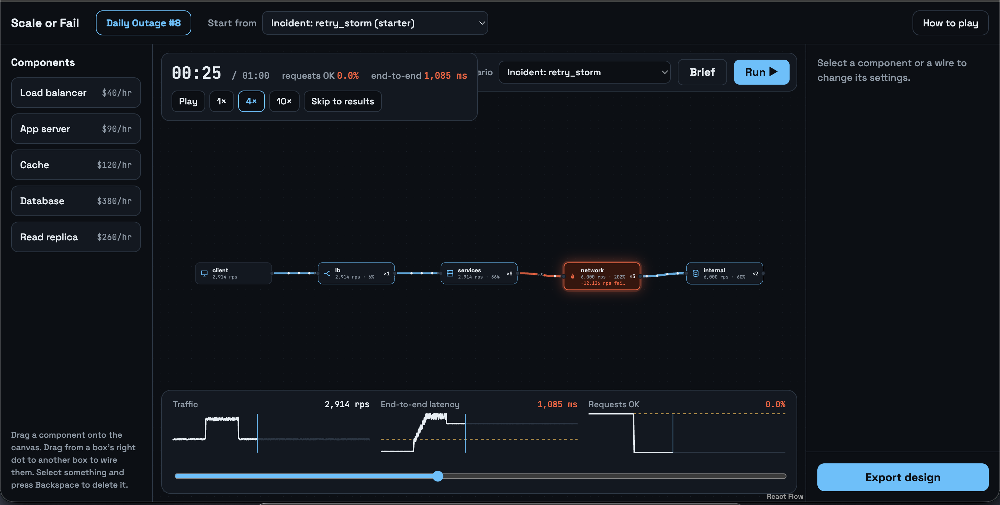
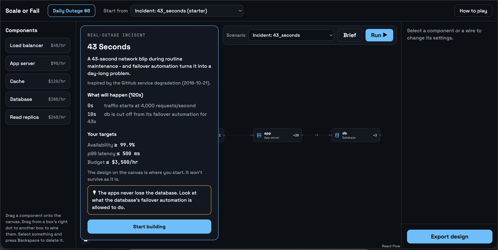
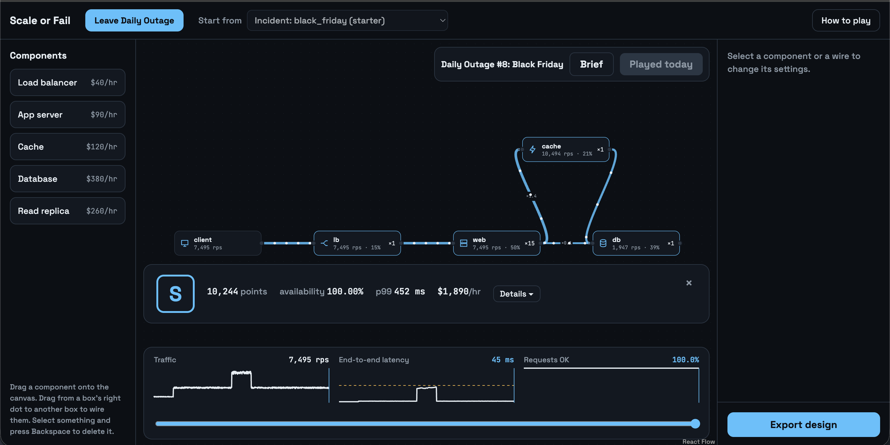
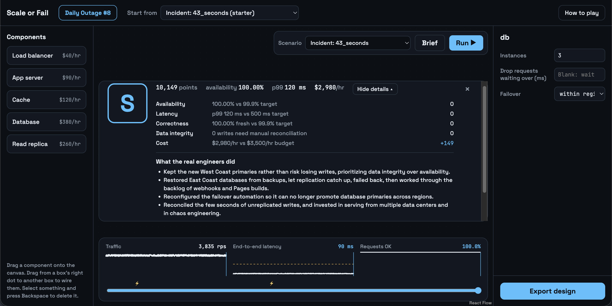
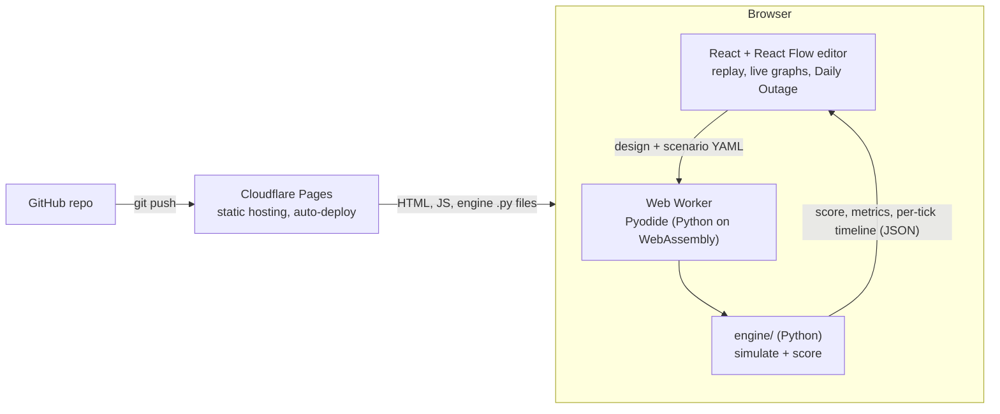

# Scale or Fail

**Survive the outages that took down the internet.** A system design game where you build an architecture, then watch it face real outages, simulated by a deterministic Python engine that runs entirely in your browser.

**▶ Play it: https://scale-or-fail.pages.dev** (no install, no sign-up; best on a laptop)


*The Retry Storm (inspired by AWS us-east-1, 2021): the surge ended at 20 s, but retries keep the network overloaded and 0% of requests succeed.*

## How it plays

1. **Read the mission brief:** what's about to happen (a traffic spike, servers dying, a network partition), your targets, and a hint if you're stuck.
2. **Build:** drag in load balancers, app servers, caches, databases and read replicas; wire them; tune instances, timeouts, retries, backoff, autoscaling, rollouts and failover.
3. **Run:** the engine simulates every request flow and the canvas replays it. Components turn amber when busy and catch fire when overloaded; wires turn red where requests fail; live graphs track traffic, latency and success rate.
4. **Get graded** S to F on availability, p99 latency, data correctness and cost, then compare your fix with **what the real engineers did**.
5. **Daily Outage:** one incident a day, the same traffic for everyone, one try, and a spoiler-free share card.

| Mission brief | The fix: an S on Black Friday | What the real engineers did |
|---|---|---|
|  |  |  |

## Architecture



- **No backend.** The same Python engine that runs the CLI and the test suite runs in the player's browser through [Pyodide](https://pyodide.org), inside a Web Worker so the page never blocks. The site is static files on Cloudflare Pages.
- **One format everywhere.** Designs and scenarios are YAML. The editor loads them, the engine reads them, and **Export design** writes them, so anything drawn in the browser runs in the CLI unchanged.
- **Deterministic.** Same design + scenario + seed = identical result. That makes the tests reliable and the Daily Outage fair: the day number is the traffic seed.

| Layer | Stack |
|---|---|
| Simulation engine | Python 3.12+, Pydantic, PyYAML, pytest (263 tests) |
| Browser runtime | Pyodide (WebAssembly) in a Web Worker |
| Game UI | React 19, TypeScript, React Flow, Vite |
| Hosting | Cloudflare Pages, deployed on every push to `main` |

## Quickstart

```bash
python3 -m venv .venv && source .venv/bin/activate
pip install -r requirements.txt
python -m engine.cli run scenarios/url_shortener.yaml designs/solid.yaml
pytest -q

# The browser game (needs Node 20+)
cd web && npm install && npm run dev   # http://localhost:5173
```

```
engine/      simulation, scoring, CLI, web_api.py (the browser entry point)
scenarios/   practice scenarios        designs/   sample designs
incidents/   real-outage scenarios: scenario + failing starter + winning solution
web/         React + TypeScript game (editor, Pyodide worker, replay, Daily Outage)
tests/       263 tests, including queueing-theory checks and every incident's starter/solution
```

## How the engine works

- A **design** is a validated directed acyclic graph of components (`designs/*.yaml`).
- A **scenario** defines traffic (base load, spikes, seeded noise), goals, and chaos events (`scenarios/*.yaml`).
- The simulator advances in fixed ticks (10 Hz). Traffic flows through the graph in topological order as rates, which keeps it fast at millions of simulated requests per second.
- Runs are deterministic: same design + scenario + seed = identical result.

## The math

| Behavior | Model |
|---|---|
| Queues | Requests a node can't serve wait in line (default limit: 1 s of capacity); overflow is dropped |
| Timeouts | Requests that would wait longer than `timeout_ms` give up (fail fast / load shedding) |
| Processing latency | M/M/1 curve: `service_time / (1 - utilization)`, utilization capped at 0.95 |
| Backlog wait | Little's Law (L = λW): `wait = queue_depth / capacity` |
| End-to-end latency | Load balancers: weighted average of targets. Sequential calls add up. Caches only count downstream on a miss |
| Tail amplification | A `parallel` fan-out of N calls waits for the slowest: `mean × H_N` (H_N = 1 + 1/2 + … + 1/N) |
| p50 / p99 | End-to-end latency percentiles across the run, weighted by traffic |
| Retries | Failed calls on an edge come back after `retry_delay_ms`, tracked per attempt up to `retries` |
| Backoff / jitter | `exponential` doubles the delay per attempt; jitter spreads each retry evenly over [0, delay] |
| Retry budget | Retries on an edge never exceed `retry_budget` × first attempts |
| Wasted work | With `caller_timeout_ms`, callers give up but the target still does the work. Late share: 1 if the backlog wait ≥ timeout, else `exp(-(timeout − wait) / processing)` |
| Cache hit ratio | TTL cache: a key requested r times/s hits `rT / (1 + rT)`; warms up over `working_set / traffic` seconds after a cold start |
| Connection pools | Little's Law: the highest rate where `rate × latency(rate) = pool_size`; excess calls are rejected |
| Read replicas | Each replica serves its reads **and** replays every write; lag = 10 ms + backlog wait |
| Stale reads | With lag L above the tolerance T, a share `1 − T/L` of a replica's reads are stale |
| Autoscaling | Target tracking: `ceil(demand / (per-instance capacity × target_utilization))`, new instances serve after `warmup_s`, scale-in after `scale_in_after_s` of low load |
| Balancing | `round_robin` gives every instance the same share; `least_outstanding` sends slow instances less (outlier detection) |
| Cost | `max(serving + booting, configured instances) × price per hour`: booting instances are billed, dead ones don't lower the bill |
| Availability / freshness | Bottom-up probabilities: a request succeeds (is fresh) only if every call it makes does; retries rescue failures `1 − fail^(1 + retries)` but not stale reads |
| Chaos events | `kill_instances`, `cache_flush`, `slow_down`, `gray_failure` (slow but still passing health checks), `bad_deploy`, `network_partition` |
| Deploys | `rollout: global` slows every instance until a human rollback; `rollout: canary` hits `canary_instances` and rolls back automatically after `canary_bake_s`; `cpu_guard` caps any slowdown at 1.5× |
| Failover | A partitioned database with `failover: cross_region` gets a new primary far away after `failover_after_s`: callers pay `cross_region_rtt_ms` per call for good, and writes taken during the partition diverge |

`tests/test_queueing_theory.py` checks the engine against queueing theory: no queue below capacity, linear queue growth when overloaded, drain time = backlog / (capacity − arrivals), the M/M/1 curve, and Little's Law.

## Scoring

Every run starts at **10,000** points:

| Line | Points |
|---|---|
| Availability below target | −1,200 per percentage point (max −6,000) |
| p99 above target | −400 per doubling (max −3,000) |
| Freshness below target | −600 per percentage point (max −3,000) |
| Diverged writes after a failover | −1 per 10 writes (max −3,000) |
| Cost | up to +1,000 under budget, up to −3,000 over |

Grades: **S** ≥ 10,000 · **A** ≥ 9,000 · **B** ≥ 7,500 · **C** ≥ 6,000 · **D** ≥ 4,000 · **F** below.

The winning move is rarely "add everything." On the URL Shortener scenario, `solid` with **8** app servers scores highest (S); 6 fail (F), and 12 go over budget (A).

## What the sample designs teach

**URL Shortener** (`scenarios/url_shortener.yaml`): a 15-second viral spike, 2.5× traffic.

| Design | Lesson |
|---|---|
| `starter` | The app saturates; scaling it 2× makes the DB **worse** (120% → 236%). The DB recovers last: a 15 s spike causes ~30 s of user pain. Grade F |
| `retry_storm` | 3 retries triple app load (7.8k → 24k rps) while throughput barely moves |
| `retry_backoff`, `retry_jitter` | In a sustained overload, backoff and jitter change *when* retries land, not how many |
| `retry_budget` | A 10% retry budget cuts retries 95% and peak load from 24k to 8.6k rps |
| `metastable` | **Metastable failure:** after the spike, traffic is back under capacity, but retries + wasted work keep the app at 12k rps and **0% success until the run ends** |
| `metastable_budget`, `metastable_shed` | A retry budget or 300 ms load shedding breaks the loop; both recover by 40 s |
| `cached` | A warm cache (87% hits) lets a small 2,000 rps DB survive the spike at ≤40% load |
| `cached_cold` | Thundering herd: a restarted cache overloads the DB to 228% at **normal** traffic |
| `cached_short_ttl` | A 5 s TTL drops hits to 28%; the DB is overloaded for the whole run |
| `pooled` | A right-sized pool (200) acts as a bulkhead: DB stays at 45 ms, p99 2,551 → 969 ms, for $0 |
| `pooled_small` | An undersized pool (100) rejects calls at normal traffic while the DB sits at 80% |
| `one_replica` | Moves the bottleneck to the replica and lags ~1 s: **90% of its reads are stale** at the peak, half of all requests get wrong answers |
| `two_replicas` | Each replica still replays every write (72%, not 60%), but lag stays at 10 ms and every read is fresh |
| `autoscaled_slow` | 30 s boot: new servers arrive 15 s after the spike ends, and you pay for them anyway |
| `autoscaled_fast` | 5 s boot fixes the app tier but pushes the DB to 360%; p99 doesn't improve |
| `fanout_search` | Each query waits for the slowest of 20 shards: 3.6× one shard's latency with every shard healthy |
| `solid` | 8 app servers + a cache: 100% availability, p99 405 ms, $1,260/hr. Grade S |

**Chaos Monkey** (`scenarios/chaos_monkey.yaml`): 5 of 8 app servers die, the cache is wiped, the DB runs 3× slower for 15 s.

| Design | Lesson |
|---|---|
| `solid` | Limps along on 3 servers at ~100% load for the rest of the run (7,076, C) |
| `solid_autoscaled` | Replaces the dead servers within ~6 s (404 → 35 ms), but nothing heals a slow database (7,217, C) |

**Gray Failure** (`scenarios/gray_failure.yaml`): one of 8 app servers gets 10× slower but keeps passing health checks.

| Design | Lesson |
|---|---|
| `solid`, `solid_autoscaled` | Round robin keeps feeding the sick server: ~9% of requests fail for 30 s, and the autoscaler sees nothing wrong (D) |
| `solid_outlier` | `least_outstanding` balancing sends the slow server less: 100% availability, p99 44 ms (S) |

## Real-outage scenarios

Each folder in `incidents/` has a `scenario.yaml` (with the real story, sources and what the engineers actually did), a `starter.yaml` that fails, and a `solution.yaml` that survives. Scenarios are simplified recreations based on public postmortems.

```bash
python -m engine.cli run incidents/retry_storm/scenario.yaml incidents/retry_storm/starter.yaml
```

| Scenario | Inspired by | Starter | What fixes it |
|---|---|---|---|
| **The Retry Storm** | AWS us-east-1, Dec 2021 | A 10 s surge becomes an outage that never ends (F) | Retry budget + backoff + load shedding, and headroom (S) |
| **Monday After the Holidays** | Slack, Jan 2021 | The network hub autoscales 45 s too late (F) | Pre-scale before the first day back (S); faster autoscaling alone still leaves a gap (B) |
| **The Bad Regex** | Cloudflare, Jul 2019 | A global deploy leaves 8% of requests working for 25 s (F) | Canary rollouts + a CPU guard (S) |
| **43 Seconds** | GitHub, Oct 2018 | Cross-region failover: half of requests fail for good, 317,867 diverged writes (F) | Failover only within a region (S); 10× the servers still can't fix the split brain (D) |
| **Black Friday** | No single incident | A design sized for a normal Tuesday (D) | Pre-scale to 15 web servers + cache the reads: the cheapest S. 30 servers scores lower (A) |

## Known limitations

- Traffic is modeled as rates, not individual requests, so jitter shows its effect on *timing* but not on the collisions between thousands of separate clients that it prevents in real systems.
- End-to-end latency is a mean per tick; p99 is taken across ticks, so tails inside a single tick are approximated (fan-out uses the exponential slowest-of-N formula).
- Calls to a database primary are treated as writes; reads are routed to replicas explicitly.
- Failover is modeled for one database primary; multi-primary and quorum databases are not.

## Roadmap

- [x] Day 1 - models, scenarios, simulator, CLI, tests
- [x] Day 2 - queues, latency, timeouts, end-to-end p50/p99, queueing-theory tests
- [x] Day 3 - retries, backoff, jitter, retry budgets, caches, connection pools, read replicas
- [x] Day 4 - autoscaling, cost, availability, scoring, chaos events
- [x] Week 2 - metastable failures, tail amplification, gray failures, correctness, billing fix
- [x] Real-outage scenarios: Retry Storm, Monday After the Holidays, Bad Regex, 43 Seconds, Black Friday
- [x] Browser game: React Flow editor, Pyodide engine, replay with live health, living wires and graphs
- [x] Mission briefs, real-engineers debrief, tutorial
- [x] Daily Outage (date-seeded daily challenge + share card), launched at https://scale-or-fail.pages.dev
- [ ] Global Daily Outage leaderboard with server-side score verification
- [ ] Break My System: design chaos to break other players' systems
- [ ] More components (message queue, CDN) and incidents
- [ ] AI-written postmortems of each run

*Not affiliated with any company referenced in scenarios.*
